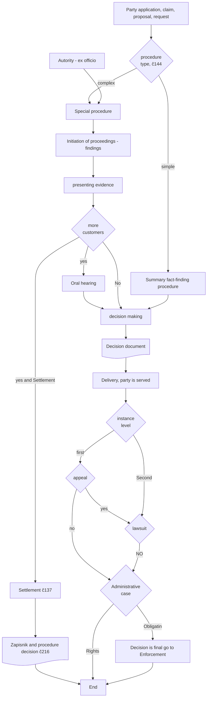
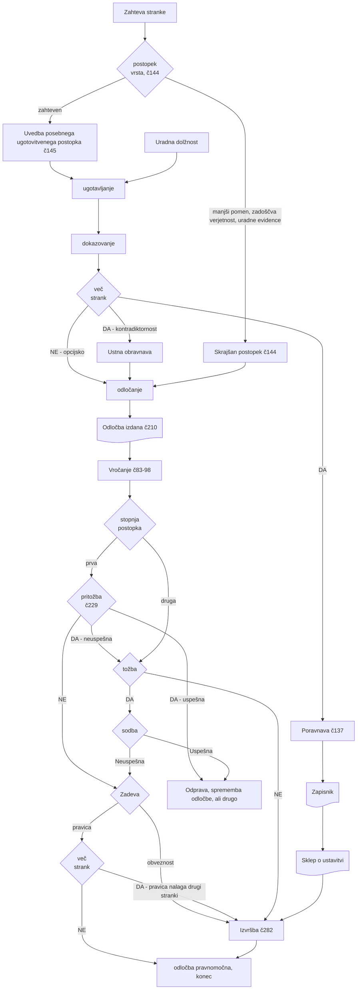

# Administrative Procedure Act

```mermaid
flowchart
    PA[Party application, claim, proposal, request]
    EU[Autority -  ex officio]
    PA --> PT{procedure<BR>type, č144}
    PT --> |simple| SFF[Summary fact-finding procedure]
    PT --> |complex| SFP[Special procedure]
    EU --> SFP
    SFP --> IP[Initiation of proceedings - findings]
    IP --> PE[presenting evidence]
    PE --> VS{more<BR> customers}
    VS --> |yes and Settlement| POR[Settlement č137]
        POR --> ZAP[Zapisnik and procedure decision č216]
        ZAP --> END
    VS --> |yes| OH[Oral hearing]
        OH --> DM
    VS --> |No| DM[decision making]
    SFF --> DM
    DM --> DMD["Decision document"]
    DMD --> DEL[Delivery, party is served]
    DEL --> IL{instance<BR> level}
    IL --> |first| CL{appeal}
    CL --> |yes| LS
    CL --> |no| AC{Administrative<BR> case} 
    AC --> |Obligatin| E[Decision is final go to Enforcement]
    AC --> |Rights| END
    IL --> |Second| LS{lawsuit}
    LS --> |NO| AC
    E --> END[End]
    DMD@{shape: doc}
    ZAP@{shape: doc}
```

# V grobem zakon o splošnem upravnem postopku

```mermaid    
flowchart
    PA[Zahteva stranke]
    EU[Uradna dolžnost]
    PA --> PT{postopek<BR>vrsta, č144}
    PT --> |manjši pomen, zadoščva verjetnost, uradne evidence| SFF[Skrajšan postopek č144]
    PT --> |zahteven| SFP[Uvedba posebnega ugotovitvenega postopka č145]
    SFP --> IP[ugotavljanje]
    EU --> IP
    IP --> PE[dokazovanje]
    PE --> VS{več<BR> strank}
    VS --> |DA - kontradiktornost| OH[Ustna obravnava]
    VS --> |DA| POR[Poravnava č137]
    POR --> ZAP["Zapisnik"]
    ZAP --> S1["Sklep o ustavitvi"]
    VS --> |NE - opcijsko| DM
    OH --> DM[odločanje]
    SFF --> DM
    DM --> DMD["Odločba izdana č210"]
    DMD --> DEL[Vročanje č83-98]
    DEL --> IL{stopnja<BR> postopka}
    IL --> |prva| CL{pritožba<BR> č229}
    CL --> |DA - neuspešna| LS
    CL --> |DA - uspešna| OS
    CL --> |NE| ZAD{Zadeva}
    ZAD --> |obveznost| E[Izvršba č282]
    ZAD --> |pravica| VS1{več<BR> strank}
    VS1 --> |DA - pravica nalaga drugi stranki| E
    VS1 --> |NE| END
    IL --> |druga| LS{tožba}
    LS --> |NE| E
    LS --> |DA| SOD{sodba}
    SOD --> |Neuspešna| ZAD
    SOD --> |Uspešna| OS[Odprava, sprememba odločbe, ali drugo]
    S1 --> E
    E --> END[odločba pravnomočna, konec]
    DMD@{shape: doc}
    S1@{shape: doc}
    ZAP@{shape: doc}
```
