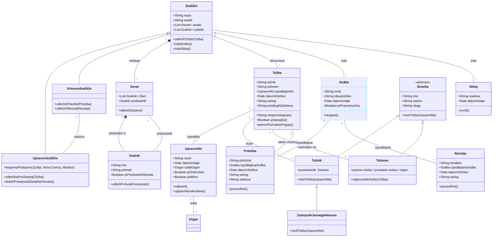

# Diagram poteka za zakon o upravnem sporu – spremno besedilo.

Sodna kontrola zakonistosti, gre za sodni spor v pristojnosti sodišč. Mora biti posamičen, se pravi posegati v položaj posameznika. Bistvo je, da gre za enakopraven položaj stranke in organa.

Tožbeni razlogi, ki jih je potrebno navesti č26:
- kršitev materialnega prava/predpisa
- kršitev pravil postopka
- nepravilna ali nepopolna ugotovitev dejanskega stanja
- ničnosti razlogi

Pri vlogi tožbe je potrebno navesti zahteve ali predloge, na kaj se tožba nanaša:
- Odprava upravnega akta
- ugotovitev nezakonitosti akta ( ugotovitvena tožba)
- tožba zaradi molka organa
- sprememba akta – spor polne juristikcije
- ugotovitev nezakonitosti dejanj človekovih pravic – prepoved nadaljevanja in odprava posledic

Nekaj pomembnih dejstev pri tožbah:
- rok za tožbo začne teči z vročitvijo upravnega akta č23 - kaj pa dokočni upravni akt
- Tožba ne zadrži izvršitve, lahko se izda začasna odredba, če se lahko povzroči težko popravljiva škoda č32. Lahko pa izda začasno odredbo
- Tožba ni dovoljena (nedopustna), če ni vložena pritožba in hkrati je bila možnost tožbe, ali gre za akt izvršljive oblasti utemeljene na politični diskresiji ali pa akt zakonodajne / sodne oblasti oblasti iz naslova ustave
- vlogo za revizijo lahko oddajo osebe, ki imajo pravniški državni izpit - odvetnik
- tožnik lahko umakne tožbo č34

Diagram poteka v grobem prikazuje kako poteka postopek upravnega spora. Prikazuje kaj so vhodi, kdo so stranke, kateri dokumenti so potrebni za odločanje. V grobem prikazuje osnovne aktivnosti in odločitve, ki jih mora sprejeti pristojno sodišče in po kateri veji lahko pridemo do konca ali rezultata/sodbe.

## Razredni diagram ZUS
    

