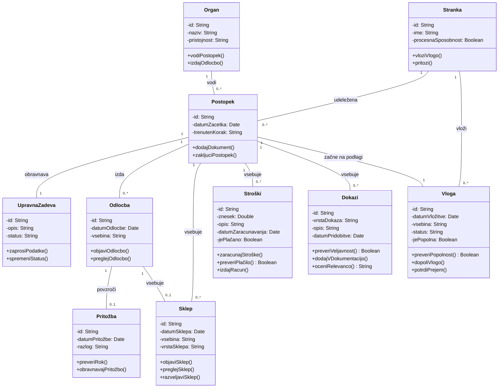

```mermaid
classDiagram
    class Organ {
        -id: String
        -naziv: String
        -pristojnost: String
        +vodiPostopek()
        +izdajOdlocbo()
    }

    class Stranka {
        -id: String
        -ime: String
        -procesnaSposobnost: Boolean
        +vloziVlogo()
        +pritozi()
    }

    class Vloga {
        -id: String
        -datumVložitve: Date
        -vsebina: String
        -status: String
        -jePopolna: Boolean
        +preveriPopolnost() Boolean
        +dopoliVlogo()
        +potrdiPrejem()
    }

    class UpravnaZadeva {
        -id: String
        -opis: String
        -status: String
        +zaprosiPodatke()
        +spremeniStatus()
    }

    class Postopek {
        -id: String
        -datumZacetka: Date
        -trenutenKorak: String
        +dodajDokument()
        +zakljuciPostopek()
    }

    class Stroški {
        -id: String
        -znesek: Double
        -opis: String
        -datumZaracunavanja: Date
        -jePlačano: Boolean
        +zaracunajStroške()
        +preveriPlačilo() Boolean
        +izdajRacun()
    }

    class Sklep {
        -id: String
        -datumSklepa: Date
        -vsebina: String
        -vrstaSklepa: String
        +objaviSklep()
        +preglejSklep()
        +razveljaviSklep()
    }

    class Dokazi {
        -id: String
        -vrstaDokaza: String
        -opis: String
        -datumPridobitve: Date
        +preveriVeljavnost() Boolean
        +dodajVDokumentacijo()
        +oceniRelevanco() String
    }

    class Odlocba {
        -id: String
        -datumOdlocbe: Date
        -vsebina: String
        +objaviOdlocbo()
        +preglejOdlocbo()
    }

    class Pritožba {
        -id: String
        -datumPritožbe: Date
        -razlog: String
        +preveriRok()
        +obravnavajPritožbo()
    }


    Organ "1" -- "0..*" Postopek : vodi
    Stranka "1" -- "0..*" Postopek : udeležena
    Stranka "1" -- "0..*" Vloga : vloži
    Postopek "1" -- "1" UpravnaZadeva : obravnava
    Postopek "1" -- "0..*" Odlocba : izda
    Postopek "1" -- "0..*" Sklep : vsebuje
    Postopek "1" -- "0..*" Stroški : vsebuje
    Postopek "1" -- "0..*" Dokazi : vsebuje
    Postopek "1" -- "1" Vloga : začne na podlagi
    Odlocba "1" -- "0..1" Pritožba : povzroči
    Odlocba "1" -- "0..1" Sklep : vsebuje
```
