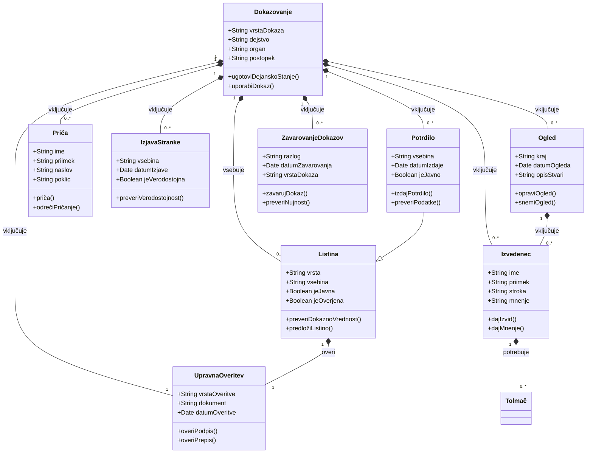

## Dokazovanje razredni diagram

```mermaid
classDiagram
    %% Razredi
    class Dokazovanje {
        +String vrstaDokaza
        +String dejstvo
        +String organ
        +String postopek
        +ugotoviDejanskoStanje()
        +uporabiDokaz()
    }

    class Listina {
        +String vrsta
        +String vsebina
        +Boolean jeJavna
        +Boolean jeOverjena
        +preveriDokaznoVrednost()
        +predložiListino()
    }

    class UpravnaOveritev {
        +String vrstaOveritve
        +String dokument
        +Date datumOveritve
        +overiPodpis()
        +overiPrepis()
    }

    class Potrdilo {
        +String vsebina
        +Date datumIzdaje
        +Boolean jeJavno
        +izdajPotrdilo()
        +preveriPodatke()
    }

    class Priča {
        +String ime
        +String priimek
        +String naslov
        +String poklic
        +priča()
        +odrečiPričanje()
    }

    class IzjavaStranke {
        +String vsebina
        +Date datumIzjave
        +Boolean jeVerodostojna
        +preveriVerodostojnost()
    }

    class Izvedenec {
        +String ime
        +String priimek
        +String stroka
        +String mnenje
        +dajIzvid()
        +dajMnenje()
    }

    class Ogled {
        +String kraj
        +Date datumOgleda
        +String opisStvari
        +opraviOgled()
        +snemiOgled()
    }

    class ZavarovanjeDokazov {
        +String razlog
        +Date datumZavarovanja
        +String vrstaDokaza
        +zavarujDokaz()
        +preveriNujnost()
    }

    %% Razmerja
    Dokazovanje "1" *-- "0..*" Listina : vsebuje
    Dokazovanje "1" *-- "0..*" Priča : vključuje
    Dokazovanje "1" *-- "0..*" IzjavaStranke : vključuje
    Dokazovanje "1" *-- "0..*" Izvedenec : vključuje
    Dokazovanje "1" *-- "0..*" Ogled : vključuje
    Dokazovanje "1" *-- "0..*" ZavarovanjeDokazov : vključuje
    Dokazovanje "1" *-- "1" UpravnaOveritev : vključuje
    Dokazovanje "1" *-- "0..*" Potrdilo : vključuje
    Listina "1" *-- "1" UpravnaOveritev : overi
    Izvedenec "1" *-- "0..*" Tolmač : potrebuje
    Ogled "1" *-- "0..*" Izvedenec : vključuje
    Potrdilo --|> Listina
```
