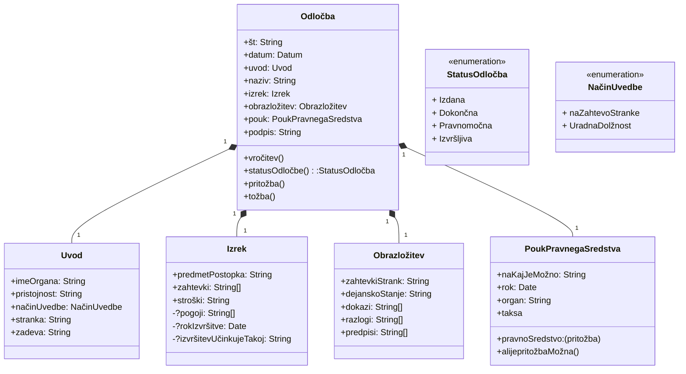

## Odločba razredni diagram

```mermaid
classDiagram
class Odločba {
    +št: String
    +datum: Datum
    +uvod: Uvod
    +naziv: String
    +izrek: Izrek
    +obrazložitev: Obrazložitev
    +pouk: PoukPravnegaSredstva
    +podpis: String
    +vročitev()
    +statusOdločbe():StatusOdločba
    +pritožba()
    +tožba()
}

class Uvod {
    +imeOrgana: String
    +pristojnost: String
    +načinUvedbe: NačinUvedbe
    +stranka: String
    +zadeva: String
}

class Izrek {
    +predmetPostopka: String
    +zahtevki: String[]
    +stroški: String
    %% optional
    -?pogoji: String[]
    -?rokIzvršitve: Date
    -?izvršitevUčinkujeTakoj: String
}

class Obrazložitev {
    +zahtevkiStrank: String
    +dejanskoStanje: String
    +dokazi: String[]
    +razlogi: String[]
    +predpisi: String[]
}

class PoukPravnegaSredstva {
    +pravnoSredstvo: (pritožba)
    +naKajJeMožno: String
    +rok: Date
    +organ: String
    +taksa
    +alijepritožbaMožna()
}

class StatusOdločba {
    <<enumeration>>
    + Izdana
    + Dokončna
    + Pravnomočna
    + Izvršljiva
}

class NačinUvedbe {
    <<enumeration>>
    + naZahtevoStranke
    + UradnaDolžnost
}

Odločba "1" *-- "1" Uvod
Odločba "1" *-- "1" Izrek
Odločba "1" *-- "1" Obrazložitev
Odločba "1" *-- "1" PoukPravnegaSredstva
```
