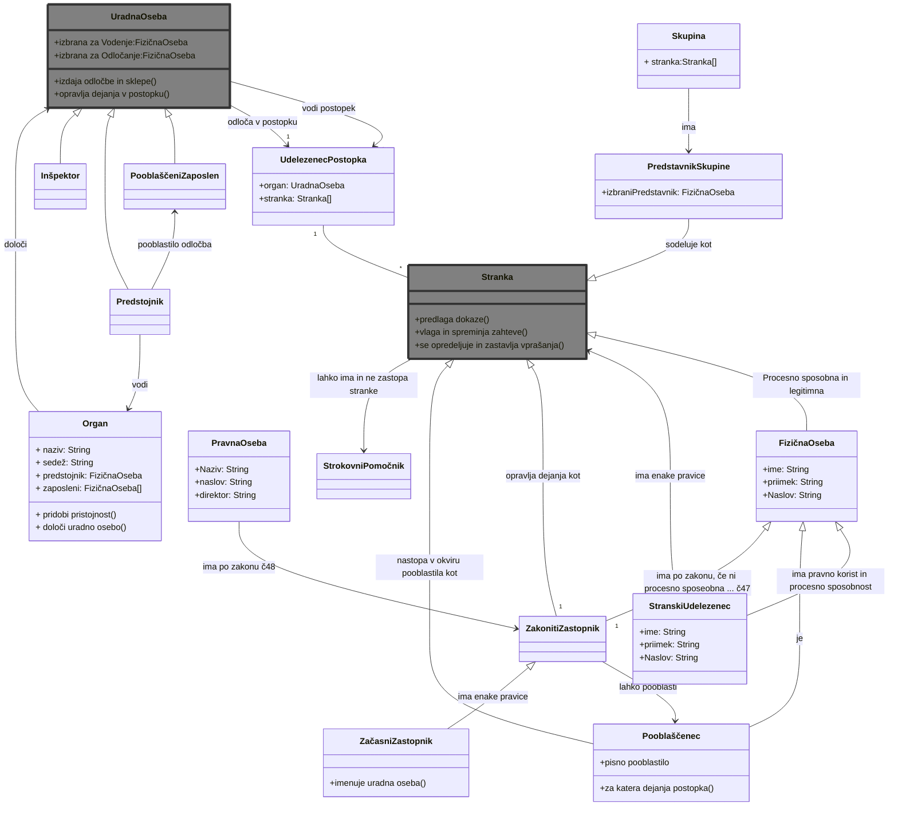

## Stranka v postopku razredni diagram

```mermaid
classDiagram

class UdelezenecPostopka{
    +organ: UradnaOseba
    +stranka: Stranka[]
}

UradnaOseba --> "1" UdelezenecPostopka : vodi postopek
UradnaOseba --> "1" UdelezenecPostopka : odloča v postopku
UdelezenecPostopka "1" -- "*"  Stranka

class FizičnaOseba{
    +ime: String
    +priimek: String
    +Naslov: String
}

class PravnaOseba{
    +Naziv: String
    +naslov: String
    +direktor: String
}

PravnaOseba --> ZakonitiZastopnik : ima po zakonu č48
ZakonitiZastopnik -->  Pooblaščenec: lahko pooblasti

class StranskiUdelezenec{
    +ime: String
    +priimek: String
    +Naslov: String
}

class Stranka{
  +predlaga dokaze()
  +vlaga in spreminja zahteve()
  +se opredeljuje in zastavlja vprašanja()
}

Stranka <|-- FizičnaOseba : Procesno sposobna in legitimna

FizičnaOseba <|-- StranskiUdelezenec : ima pravno korist in procesno sposobnost
FizičnaOseba <|-- Pooblaščenec: je


Stranka <-- StranskiUdelezenec : ima enake pravice

class ZakonitiZastopnik{
}

FizičnaOseba <|-- "1" ZakonitiZastopnik: ima po zakonu, če ni procesno sposeobna ... č47
Stranka <|-- "1" ZakonitiZastopnik: opravlja dejanja kot
Stranka <|-- Pooblaščenec: nastopa v okviru pooblastila kot

class Pooblaščenec{
  +pisno pooblastilo
  +za katera dejanja postopka()
}


class ZačasniZastopnik{
  +imenuje uradna oseba()
}

ZakonitiZastopnik <|-- ZačasniZastopnik : ima enake pravice
%% UradnaOseba --> ZačasniZastopnik : imenuje

class PredstavnikSkupine{
 +izbraniPredstavnik: FizičnaOseba
}
class Skupina{
 + stranka:Stranka[]
}
Skupina --> PredstavnikSkupine : ima
PredstavnikSkupine --|> Stranka : sodeluje kot

class Organ{
  + naziv: String
  + sedež: String
  + predstojnik: FizičnaOseba
  + zaposleni: FizičnaOseba[]
  + pridobi pristojnost()
  + določi uradno osebo()
}

class UradnaOseba{
  +izbrana za Vodenje:FizičnaOseba
  +izbrana za Odločanje:FizičnaOseba
  +izdaja odločbe in sklepe()
  +opravlja dejanja v postopku()
}

%% PooblaščeniZaposlen <-- FizičnaOseba
UradnaOseba <|-- PooblaščeniZaposlen
UradnaOseba <|-- Predstojnik
UradnaOseba <|-- Inšpektor
PooblaščeniZaposlen <-- Predstojnik : pooblastilo odločba
Predstojnik --> Organ : vodi

UradnaOseba <-- Organ : določi


Stranka --> StrokovniPomočnik : lahko ima in ne zastopa stranke
style Stranka fill:#808080,stroke:#333,stroke-width:4px
style UradnaOseba fill:#808080,stroke:#333,stroke-width:4px
```
