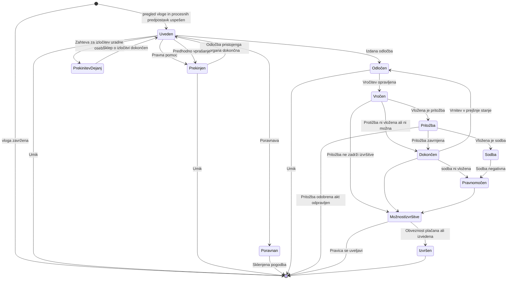

## Diagram stanj za upravni postopek

```mermaid
stateDiagram-v2
[*] --> [*] : vloga zavržena
[*] --> Uveden : pregled vloge in procesnih predpostavk uspešen
Uveden --> [*] : Umik

Uveden --> Prekinjen : Pravna pomoč
Prekinjen --> Uveden : Odločba pristojenga organa dokončna
Prekinjen --> [*] : Umik
Uveden --> Prekinjen : Predhodno vprašanje
Uveden --> Odločen : Izdana odločba
Uveden --> Poravnan : Poravnava
Uveden --> PrekinitevDejanj : Zahteva za izločitev uradne osebe
PrekinitevDejanj --> Uveden : Sklep o izločitvi dokončen
Poravnan --> [*] : Sklenjena pogodba
Odločen --> Vročen : Vročitev opravljena
Odločen --> [*] : Umik
Vročen --> Dokončen : Protižba ni vložena ali ni možna
Vročen --> MožnostIzvršitve : Pritožba ne zadrži izvršitve
Vročen --> Pritožba : Vložena je pritožba
Dokončen --> Odločen : Vrnitev v prejšnje stanje
Dokončen --> MožnostIzvršitve
Dokončen --> Pravnomočen : sodba ni vložena
Pritožba --> Sodba : Vložena je sodba
Pritožba --> Dokončen : Pritožba zavrnjena
Pritožba --> [*] : Pritožba odobrena akt odpravljen
Sodba --> Pravnomočen: Sodba negativna
Pravnomočen --> MožnostIzvršitve
MožnostIzvršitve --> Izvršen : Obveznost plačana ali izvedena
MožnostIzvršitve --> [*] : Pravica se uveljavi
Izvršen --> [*]
```
