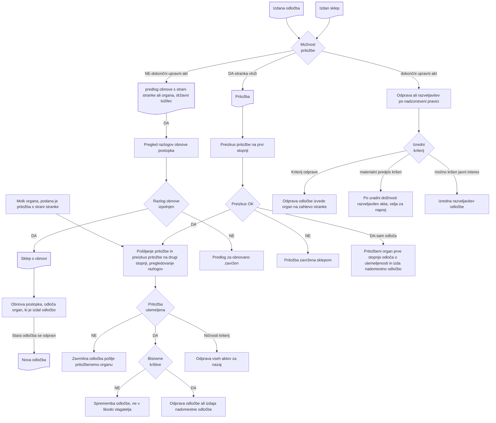

Spodaj so prikazane možnosti, ki jih imata stranka in organ pri ugovorih na izdan končni upravni akt.

```mermaid
flowchart
ODL[Izdana odločba]
S1[Izdan sklep]
MO[Molk organa, podana je pritožba s strani stranke]
MP{Možnost<BR> pritožbe}
ODL --> MP
S1 --> MP
MO --> PP2
MP --> |NE-dokončni upravni akt| PO[predlog obnove s strani stranke ali organa, državni tožilec]
PO --> |DA| PRO[Pregled razlogov obnove postopka]
PRO --> KI{Razlog obnove<BR> izpolnjen}
KI --> |DA| SOO[Sklep o obnovi]
SOO --> OP[Obnova postopka, odloča organ, ki je izdal odločbo]
KI --> |NE| POZ[Predlog za obnovano zavržen]
OP --> |Stara odločba se odpravi| NO[Nova odločba]
MP --> |DA-stranka vloži| PRI[Pritožba]
PRI --> PP1[Preizkus pritožbe na prvi stopnji]
PP1 --> PZ{Preizkus OK}
PZ --> |DA| PP2[Pošiljanje pritožbe in preizkus pritožbe na drugi stopnji, pregledovanje razlogov]
PP2 --> PU{Pritožba<BR> utemeljena}
PU --> |NE| ZO[Zavrnilna odločba pošlje pritožbenemu organu]
PU --> |DA| BK{Bistvene<BR> kršitve}
BK --> |NE| POP[Sprememba odločbe, ne v škodo vlagatelja]
BK --> |DA| OOR[Odprava odločbe ali izdaja nadomestne odločbe]
PZ --> |NE| PZAV[Pritožba zavržena sklepom]
PZ --> |DA-sam odloča| POO[Pritožbeni organ prve stopnje odloča o utemeljenosti in izda nadomestno odločbo]
MP --> |dokončni upravni akt| ORN[Odprava ali razveljavitev po nadzorstveni pravici]
ORN --> IKI{Izredni<BR> kriterij}
IKI --> |Kriterij odprave| ODPR[Odprava odločbe izvede organ na zahtevo stranke]
IKI --> |materialni predpis kršen| RAZ[Po uradni dolžnosti razveljavitev akta, velja za naprej]
IKI --> |močno kršen javni interes| IRO[Izredna razveljavitev odločbe]
%% ali je iz IKIIKI
PU --> |Ničnosti kriterij| NIC[Odprava vseh aktov za nazaj]

ODL@{shape: doc}
S1@{shape: doc}
PRI@{shape: doc}
PO@{shape: doc}
NO@{shape: doc}
SOO@{shape: doc}

```
