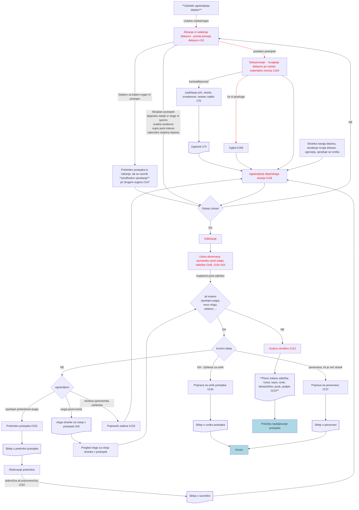

## Uvedbeni postopek

```mermaid
flowchart
ZU[**Začetek ugotavljanja dejstev**]
ZU --> |Uradna oseba/organ| ZD[Zbiranje in selekcija dokazov - prosta presoja dokazov č10]
ZD --> |poseben postopek| ID[Dokazovanje  - Izvajanje dokazov po načelu materialne resnice č164]
    ID --> |kontradiktornost| ZP[zaslišanje prič, strank, izvedencev, sestavi vabilo č70]
        ZP --> ZAP["Zapisnik ć74"]
        ZAP --> UDS
    ID --> |če ni predrago| OG[Ogled č199]
        OG --> UDS
    ID --> UDS[Ugotavljanje dejanskega stranja č139]
    STRANKA[Stranka navaja dejstva, seodeuje izvaja dokaze, ugovarja, sprašuje se izreka] --> UDS
ZD --> |Dejstvo za katero organ ni pristojen| PPPV[Prekinitev postopka in čakanje, da se razreši **predhodno vprašanje** pri drugem organu č147]
    PPPV --> DZ
ZD --> |Skrajšan postopek<BR>dejansko stanje iz vloge ni sporno<BR>uradne evidence<BR>nujno javni interes<BR>zakonsko verjetna dejstva| DZ
UDS --> DZ{Dokazi zbrani}
DZ --> |DA| OD[Odločanje]
    OD --> UO[Ustna obravnava, seznanitev pred izdajo odločbe č146, č154-163]
DZ --> |NE| ZD
    UO --> |Kadarkoli pred odločbo| KPO{ali imamo<BR> izpolnjen pogoj,<BR> novo vlogo,<BR> zahtevo ...}
KPO --> |NE| IS[Izračun stroškov č113]
    IS --> ODL["**Pisno izdana odločba: Uvod, naziv, izrek, obrazložitev, pouk, podpis č210**"]
KPO --> |DA| KPOKON{Končni sklep}
    KPOKON --> |DA - Zahteva za umik| UP[Priprava na umik postopka č134]
        UP --> S21["Sklep o umiku postopka"]
    KPOKON --> |poravnava, če je več strank| POR[Priprava na poravnavo č137]
        POR --> S22["Sklep o poravnavi"]
    KPOKON --> |NE| KPOU{ugotovljeno}
        KPOU --> |vložena sprememba zahtevka| SZ[Popravek zadeve č133]
            SZ --> UDS
        KPOU --> |izpolnjen prekinitveni pogoj| PRP[Prekinitev postopka č153]
            PRP --> S23["Sklep o prekinitvi postopka"]
            S23 --> RPREK[Reševanje prekinitve]
            RPREK --> |dokončna ali pravnomočna č152| S24["Sklep o razrešitvi"]
        KPOU --> |pogoj javna korist| VS@{shape: doc, label: "vloga stranke za vstop v postopek č63"}
            VS --> VSP[Pregled vloge za vstop stranke v postopek]
            VSP --> KPO
S24 --> UDS
S21 --> KON
S22 --> KON
KON[Konec]
ODL --> NAD[Pritožba nadaljevanje postopka]
S21@{shape: doc}
S22@{shape: doc}
S23@{shape: doc}
S24@{shape: doc}
ODL@{shape: doc}
ZAP@{shape: doc}
style KON fill:#add8e6
style NAD fill:#add8e6
style ZD color:red
style ID color:red
style UDS color:red
style OD color:red
style UO color:red
style IS color:red
linkStyle 0 stroke:red;
linkStyle 1 stroke:red;
linkStyle 5 stroke:red;

```
