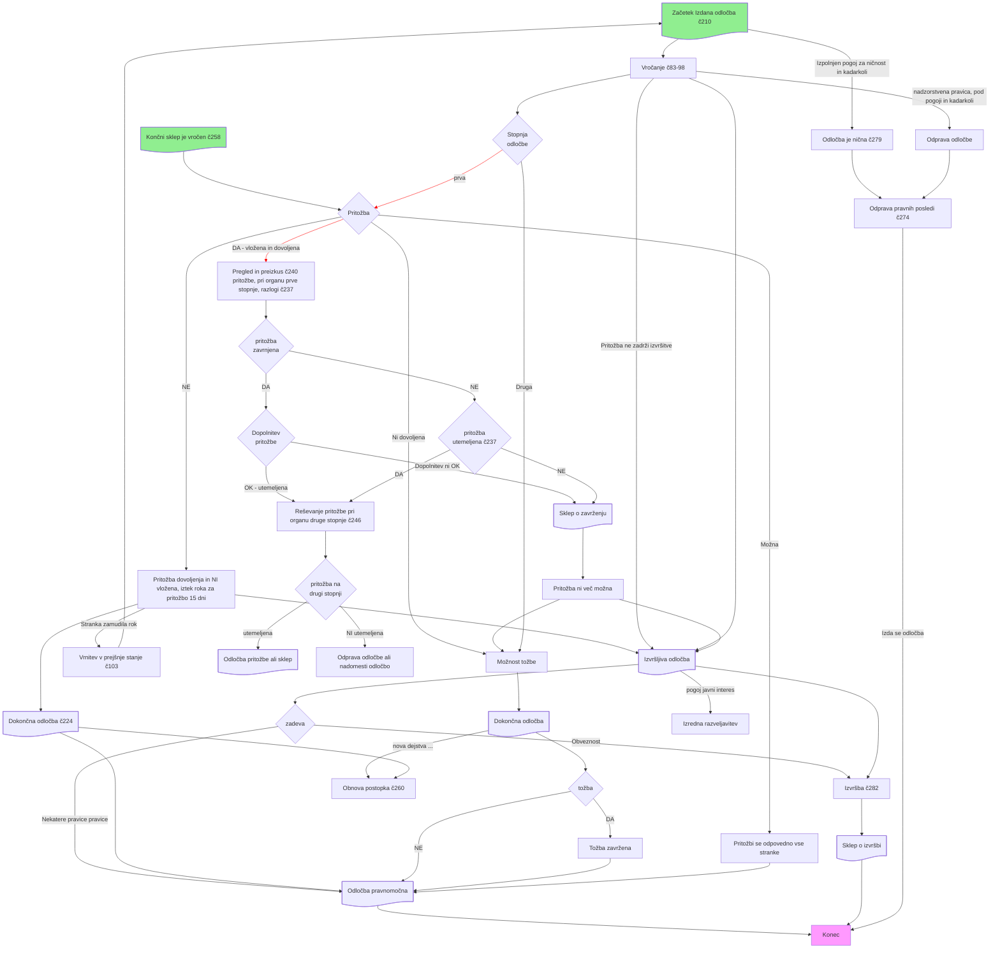

## Pritožba

```mermaid
flowchart
ODL@{shape: doc, label: "Začetek Izdana odločba č210"}
SK@{shape: doc, label: "Končni sklep je vročen č258"}
SK --> PRI
ODL --> |Izpolnjen pogoj za ničnost in kadarkoli| NIC[Odločba je nična č279]
NIC --> OPP[Odprava pravnih posledi č274]
ODL --> VR[Vročanje č83-98]
VR --> |nadzorstvena pravica, pod pogoji in kadarkoli| ODPR[Odprava odločbe]
ODPR --> OPP
VR --> SO{Stopnja<BR> odločbe}
SO --> |prva| PRI{Pritožba}
DODL@{shape: doc, label: "Dokončna odločba č224"}
PRI --> |NE| IROK[Pritožba dovoljenja in NI vložena, iztek roka za pritožbo 15 dni]
    IROK --> DODL
    IROK --> IZODL
    IZODL --> V1{zadeva}
    IZV[Izvršba č282]
    IZV --> S31@{shape: doc, label: "Sklep o izvršbi"}
    V1 --> |Obveznost| IZV
    V1 --> |Nekatere pravice pravice| PMODL
    IROK --> |Stranka zamudila rok| VPS[Vrnitev v prejšnje stanje č103]
    VPS --> ODL
    DODL --> PMODL
PRI --> |DA - vložena in dovoljena| PPRI[Pregled in preizkus č240 pritožbe, pri organu prve stopnje, razlogi č237]
    PPRI --> PZ{pritožba<BR> zavrnjena}
    PZ --> |DA| DP{Dopolnitev<BR> pritožbe}
        DP --> |Dopolnitev ni OK| S32@{shape: doc, label: "Sklep o zavrženju"}
        S32 --> PNM
        DP --> |OK - utemeljena| RPDS
    PZ --> |NE| PU{pritožba<BR> utemeljena č237}
        PU --> |NE| S32
        PU --> |DA| RPDS[Reševanje pritožbe pri organu druge stopnje č246]
        RPDS --> ODL2{pritožba na<BR> drugi stopnji}
        ODL2 --> |utemeljena| PRIODL
        ODL2 --> |NI utemeljena| OODL[Odprava odločbe ali nadomesti odločbo]
PRI --> |Ni dovoljena| MT[Možnost tožbe]
    MT --> DODL1@{shape: doc, label: "Dokončna odločba"}
    DODL1 --> TOZ{tožba}
    TOZ --> |NE| PMODL
    TOZ --> |DA| TOZZ[Tožba zavržena]
    TOZZ --> PMODL
PRI --> |Možna| PRIO[Pritožbi se odpovedno vse stranke]
    PRIO --> PMODL
VR --> |Pritožba ne zadrži izvršitve| IZODL
VR --> IZODL
PNM[Pritožba ni več možna]
PNM --> IZODL@{shape: doc, label: "Izvršljiva odločba"}
IZODL --> |pogoj javni interes| IZRAZ[Izredna razveljavitev]
IZODL --> IZV
PNM --> MT
DODL1 --> |nova dejstva ...| IZOP[Obnova postopka č260]
DODL --> IZOP
PMODL@{shape: doc, label: "Odločba pravnomočna"}
PRIODL@{shape: doc, label: "Odločba pritožbe ali sklep"}
SO --> |Druga| MT
PMODL --> KON    
S31 --> KON
OPP --> |Izda se odločba| KON
KON[Konec]
%% linkStyle default stroke:green;
style ODL fill:#90ee90
style SK fill:#90ee90
style KON fill:#f9f
linkStyle 7 stroke:red;
linkStyle 18 stroke:red;
%% VR --> SO

```
