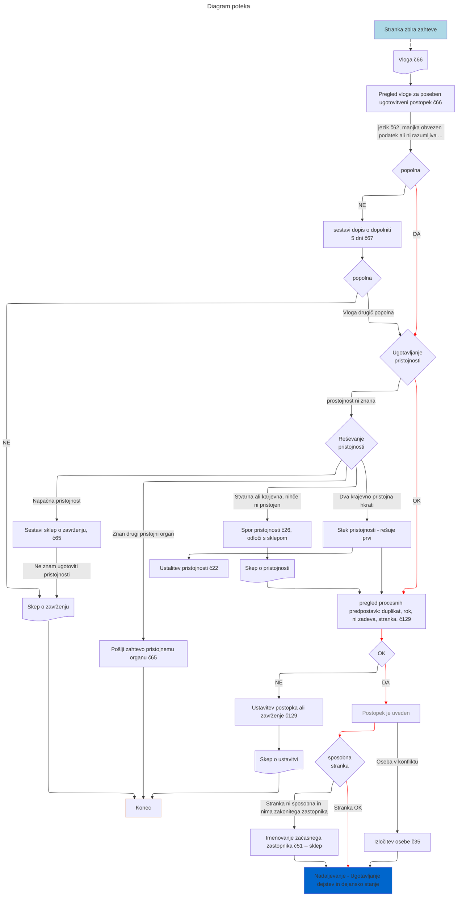

# Uvedba postopka

```mermaid
---
config:
  layout: elk
title: Diagram poteka
---
flowchart
PUP[Stranka zbira zahteve]
PUP e1@--> VLO@{shape: doc, label: "Vloga č66"}
VLO --> PV[Pregled vloge za poseben ugotovitveni postopek č66]
PV --> |jezik č62, manjka obvezen podatek ali ni razumljiva ...| V1{popolna}
V1 --> |NE| DOD[sestavi dopis o dopolniti<BR> 5 dni č67]
V1 --> |DA| UP{Ugotavljanje<BR> pristojnosti}
DOD --> V3{popolna}
V3 --> |NE| S13
V3 --> |Vloga drugič popolna| UP
UP --> |OK| PPP[pregled procesnih predpostavk: duplikat, rok, ni zadeva, stranka. č129]
UP --> |prostojnost ni znana| UPRI{Reševanje<BR> pristojnosti}
UPRI --> |Napačna pristojnost| NP[Sestavi sklep o zavrženju, č65]
UPRI --> |Znan drugi pristojni organ| NP1[Pošlji zahtevo pristojnemu organu č65]
NP --> |Ne znam ugotoviti pristojnosti| S13@{shape: doc, label: "Skep o zavrženju"}
UPRI --> |Stvarna ali karjevna, nihče ni pristojen| UPSP[Spor pristojnosti č26, odloči s sklepom]
UPRI --> |Dva krajevno pristojna hkrati| UPST[Stek pristojnosti - rešuje prvi]
UPST --> USPRI[Ustalitev pristojnosti č22]
UPSP --> S11@{shape: doc, label: "Skep o pristojnosti"}
UPST --> PPP
S11 --> PPP
PPP --> V2{OK}
V2 --> |NE| UPZ[Ustavitev postopka ali zavrženje č129]
UPZ --> S12@{shape: doc, label: "Skep o ustavitvi"}
V2 --> |DA| PU
PU[Postopek je uveden]
PU --> USS{sposobna<BR> stranka}
USS --> |Stranka OK| UDDS
USS --> |Stranka ni sposobna in nima zakonitega zastopnika| IZZ[Imenovanje začasnega zastopnika č51 -- sklep]
IZZ --> UDDS
PU --> |Oseba v konfliktu| IO[Izločitev osebe č35]
IO --> UDDS
UDDS[Nadaljevanje - Ugotavljanje dejstev in dejansko stanje]
S13 --> KON
S12 --> KON
NP1 --> KON
KON[Konec]
e1@{ animate: true }
style PUP fill:#add8e6
style KON stroke:#e6bbad
style UDDS fill:#0066cc
style PU color:#808080
linkStyle 4 stroke:red;
linkStyle 8 stroke:red;
linkStyle 19 stroke:red;
linkStyle 22 stroke:red;
linkStyle 23 stroke:red;
linkStyle 24 stroke:red;
```
