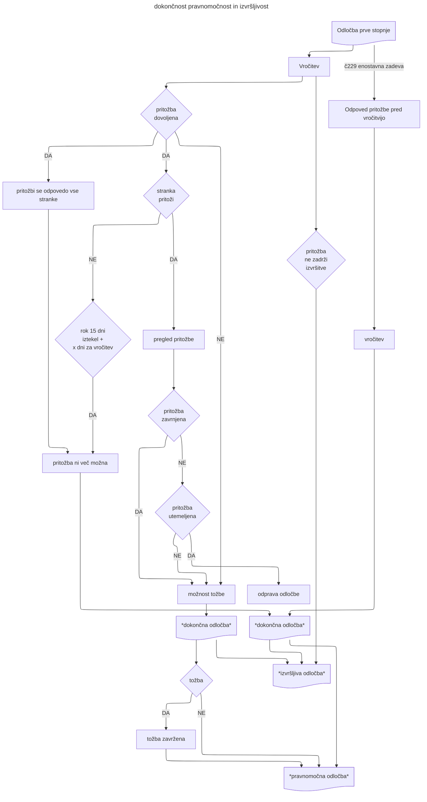

```mermaid
---
config:
  layout: elk
title: dokončnost pravnomočnost in izvršljivost
---
flowchart
A[Odločba prve stopnje]
A --> VR[Vročitev]
VR --> PD{pritožba<BR> dovoljena}
PD --> |DA| B[pritožbi se odpovedo vse stranke]
    B --> PND[pritožba ni več možna]
PD --> |NE| TO
PD --> |DA| SP{stranka<BR> pritoži}
SP --> |NE| RI{rok 15 dni<BR> iztekel +<BR>x dni za vročitev}
SP --> |DA| PP[pregled pritožbe]
PP --> PZ{pritožba<BR> zavrnjena}
PZ --> |DA| TO
PZ --> |NE| PU{pritožba<BR> utemeljena}
    PU --> |DA| RO[odprava odločbe]
    PU --> |NE| TO[možnost tožbe]
    TO --> DO[*dokončna odločba*]
    DO --> TOZ{tožba}
        TOZ --> |NE| PO
        TOZ --> |DA| TZ[tožba zavržena]
RI --> |DA| PND
PND --> D
A --> |č229 enostavna zadeva| OPV[Odpoved pritožbe pred vročitvijo]
OPV --> V2[vročitev]
VR --> PZI{pritožba<BR> ne zadrži<BR> izvršitve}
DO --> ID
D --> ID
PZI --> ID[*izvršljiva odločba*]
V2 --> D
D[*dokončna odločba*]
D --> PO[*pravnomočna odločba*]
TZ --> PO
PO@{shape: doc}
ID@{shape: doc}
A@{shape: doc}
D@{shape: doc}
DO@{shape: doc}
```
