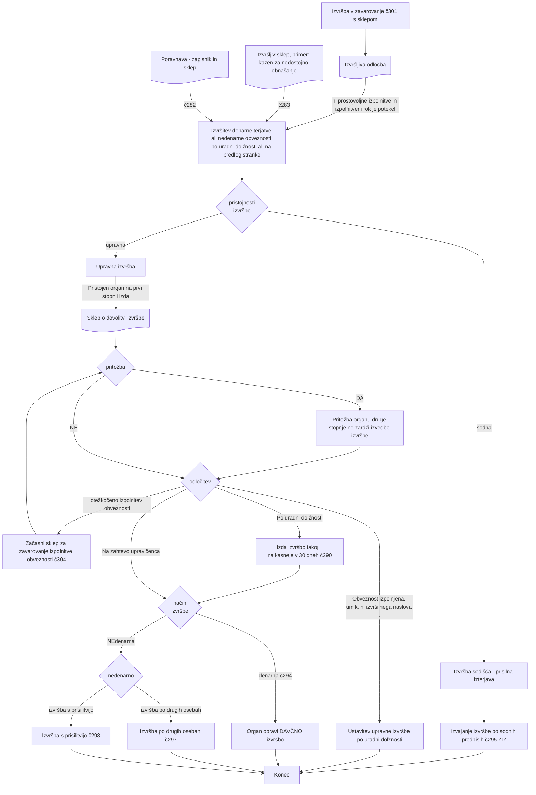

## Izvršba

```mermaid
flowchart TD
    ZAVIZV[Izvršba v zavarovanje č301 s sklepom]
    ZAVIZV --> ODL
    ODL["Izvršljiva odločba"]
    IS@{shape: doc, label: "Izvršljiv sklep, primer: kazen za nedostojno obnašanje"}
    POR@{shape: doc, label: "Poravnava - zapisnik in sklep"}
    ODL --> |ni prostovoljne izpolnitve in izpolnitveni rok je potekel| IZV[Izvršitev denarne terjatve ali nedenarne obveznosti po uradni dolžnosti ali na predlog stranke]
    IS --> |č283| IZV
    POR --> |č282| IZV
    IZV --> VI1{pristojnosti<BR> izvršbe}
    VI1 --> |sodna| IZV1[Izvršba sodišča - prisilna izterjava]
        IZV1 --> SODIZV[Izvajanje izvršbe po sodnih predpisih č295 ZIZ]
        SODIZV --> KON
    VI1 --> |upravna| IZV2[Upravna izvršba]
        IZV2 --> |Pristojen organ na prvi stopnji izda| SOI@{shape: doc, label: "Sklep o dovolitvi izvršbe"}        
        SOI --> IZVPRI{pritožba}
        IZVPRI --> |DA| C292[Pritožba organu druge stopnje ne zardži izvedbe izvršbe]
            C292 --> VI3
        IZVPRI --> |NE| VI3{odločitev}
        VI3 --> |Obveznost izpolnjena, umik, ni izvršilnega naslova ...| UST[Ustavitev upravne izvršbe po uradni dolžnosti]
            UST --> KON
        VI3 --> |otežkočeno izpolnitev obveznosti| IZVZAV[Začasni sklep za zavarovanje izpolnitve obveznosti č304]
            IZVZAV --> IZVPRI
        VI3 --> |Po uradni dolžnosti| IZVUD[Izda izvršbo takoj,  najkasneje v 30 dneh č290]
        IZVUD --> VI4
        VI3 --> |Na zahtevo upravičenca| VI4
        VI4{način<BR> izvršbe}
        VI4 --> |denarna č294| IZV3[Organ opravi DAVČNO izvršbo]
            IZV3 --> KON
        VI4 --> |NEdenarna| IZV4{nedenarno}
            IZV4--> |izvršba po drugih osebah| C297[Izvršba po drugih osebah č297]
                C297 --> KON
            IZV4--> |izvršba s prisilitvijo| C298[Izvršba s prisilitvijo č298]
                C298 --> KON
    %% |Samo med uradnimi uravmi med 6 in 20.00| IZVD[Izvršilno dejanje]
    KON[Konec]
    ODL@{shape: doc}
```
