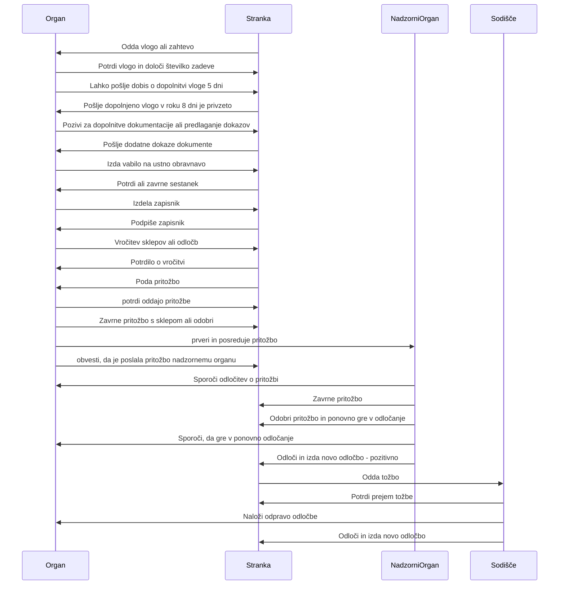

## Sekvenčni diagram

```mermaid
sequenceDiagram
participant Organ
participant Stranka
participant NadzorniOrgan
participant Sodišče
Stranka->>Organ: Odda vlogo ali zahtevo
Organ->>Stranka: Potrdi vlogo in določi številko zadeve

Organ->>Stranka: Lahko pošlje dobis o dopolnitvi vloge 5 dni
Stranka->>Organ: Pošlje dopolnjeno vlogo v roku 8 dni je privzeto

Organ->>Stranka: Pozivi za dopolnitve dokumentacije ali predlaganje dokazov
Stranka->>Organ: Pošlje dodatne dokaze dokumente

Organ->>Stranka: Izda vabilo na ustno obravnavo
Stranka->>Organ: Potrdi ali zavrne sestanek

Organ->>Stranka: Izdela zapisnik
Stranka->>Organ: Podpiše zapisnik

Organ->>Stranka: Vročitev sklepov ali odločb
Stranka->>Organ: Potrdilo o vročitvi

Stranka->>Organ: Poda pritožbo
Organ->>Stranka: potrdi oddajo pritožbe

Organ->>Stranka: Zavrne pritožbo s sklepom ali odobri

Organ->>NadzorniOrgan: prveri in posreduje pritožbo

Organ->>Stranka: obvesti, da je poslala pritožbo nadzornemu organu
NadzorniOrgan->>Organ: Sporoči odločitev o pritožbi
NadzorniOrgan->>Stranka: Zavrne pritožbo
NadzorniOrgan->>Stranka: Odobri pritožbo in ponovno gre v odločanje
NadzorniOrgan->>Organ: Sporoči, da gre v ponovno odločanje
NadzorniOrgan->>Stranka: Odloči in izda novo odločbo - pozitivno

Stranka->>Sodišče: Odda tožbo
Sodišče->>Stranka: Potrdi prejem tožbe
Sodišče->>Organ: Naloži odpravo odločbe
Sodišče->>Stranka: Odloči in izda novo odločbo
```
