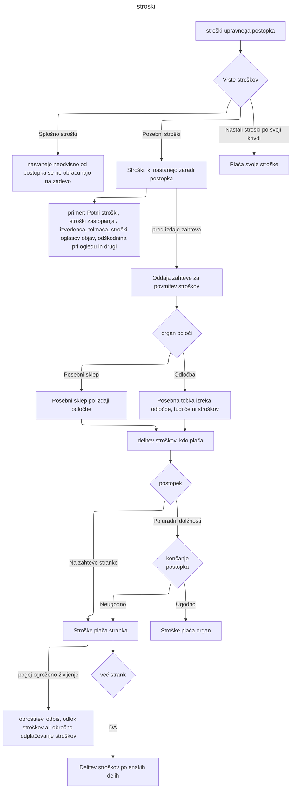

```mermaid
---
config:
  layout: elk
title: stroski
---
flowchart
STR[stroški upravnega postopka]
STR --> VRS{Vrste stroškov}
VRS --> |Splošno stroški| SP[nastanejo neodvisno od postopka se ne obračunajo na zadevo]
VRS --> |Posebni stroški| PS[Stroški, ki nastanejo zaradi postopka]
VRS --> |Nastali stroški po svoji krivdi| K[Plača svoje stroške]
PS --> POTS[primer: Potni stroški, stroški zastopanja / izvedenca, tolmača, stroški oglasov objav, odškodnina pri ogledu in drugi]
PS --> |pred izdajo zahteva| POV[Oddaja zahteve za povrnitev stroškov]
POV --> OO{organ odloči}
OO --> |Posebni sklep| SKL[Posebni sklep po izdaji odločbe]
OO --> |Odločba| ODL[Posebna točka izreka odločbe, tudi če ni stroškov]
ODL --> DEL[delitev stroškov, kdo plača]
SKL --> DEL
DEL --> POS{postopek}
POS --> |Po uradni dolžnosti| KON{končanje<BR> postopka}
KON --> |Neugodno| SPS[Stroške plača stranka]
KON --> |Ugodno| SPO[Stroške plača organ]
POS --> |Na zahtevo stranke| SPS[Stroške plača stranka]
SPS --> |pogoj ogroženo življenje| OPR[oprostitev, odpis, odlok stroškov ali obročno odplačevanje stroškov]
SPS --> VS{več strank}
VS --> |DA| DSVS[Delitev stroškov po enakih delih]
```
