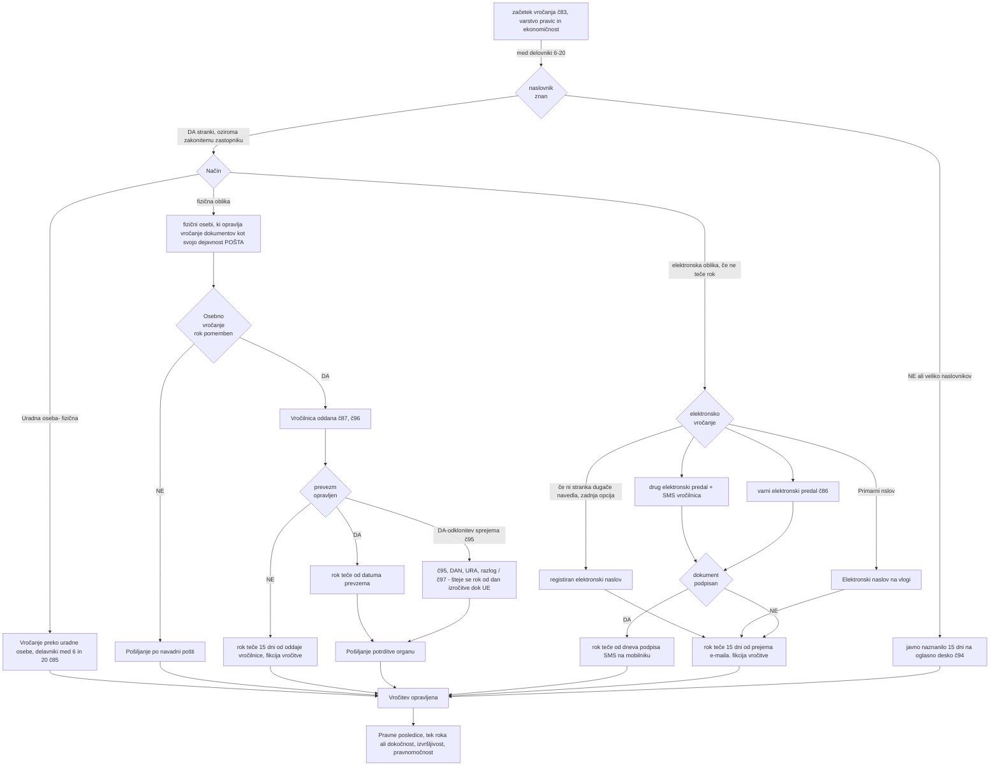

## Vročanje 
Pravne posledice odločbe ali sklepa lahko nastanejo šele po njegovi vročitvi
Kadar ima stranka zakonitega zastopnika ali pooblaščenca, se vroča njemu.
Uradna oseba se mora vprašati 
- ali je rok pisanja pomemben ( pri odločbah je)
- ali lahko vroča elektronsko po prioriteti, email na vlogi, vrani elektronski predal, drugi predal, registriran e-mail
- Komu vroča glede na tip osebe, pravna/fizična oseba
- ali sploh imamo naslov za dostavo in ali jih je preverč, recimo več kot 20

| Glede na način  | Po kateri poti           | Rok pomemben | Tip osebe   | Opis – scenarija                                                                                          | Opomba                            |
| --------------- | ------------------------ | ------------ | ----------- | --------------------------------------------------------------------------------------------------------- | --------------------------------- |
| Fizično         | Osebno-pošta             | DA           | Fizična     | Poštar z vročilnico v stanovanje                                                                          |                                   |
| Fizično         | Osebno-Uradna oseba      | DA           | Fizična     | Uradna oseba gre na dom ali pa pokliče fizično osebo naj pride na Urad – zapisnik vročitve                |                                   |
| Fizično         | Osebno-pošta             | DA           | Pravna      | Poštar z vročilnico na podjetju zakonitemu zastopniku                                                     |                                   |
| Fizično         | Osebno-Uradna oseba      | DA           | Pravna      | Uradna oseba gre na podjetje ali pa pokliče zakonitega zastopnika naj pride na Urad - zapisnik vročitve   |                                   |
| Fizično         | Navadno-Pošta            | NE           | Fizična     | Pošiljanje po navadni pošti stranki, ki je fizična oseba                                                  | Se izogibamo ni ekonomično        |
| Fizično         | Navadno-Pošta            | NE           | Pravna      | Pošiljanje po navadni pošti zakonitemu zastopniku                                                         | Se izogibamo                      |
| Elektronsko     | E-mail na vlogi          | NE           | ni bistveno | Pošiljanje po elektronski pošti navedeni na vlogi                                                         |                                   |
| Elektronsko     | E-mail na vlogi          | DA           | ni bistveno | Pošiljanje po elektronski pošti navedeni na vlogi – kako je z vročilnico oz potrditvijo?                  |                                   |
| Elektronsko     | Varni elektronski predal | NE           | ni bistveno | Pošiljanje na varni elektronski predal                                                                    | Vprašanje, če ima kdo?            |
| Elektronsko     | Varni elektronski predal | DA           | ni bistveno | Pošiljanje na varni elektronski predal – rok teče, ko dobimo podpisan dokument z kvalificiranim potrdilom |                                   |
| Elektronsko     | Drugi elektronski predal | NE           | ni bistveno | Pošiljanje na drugi elektronski predal                                                                    |                                   |
| Elektronsko     | Drugi elektronski predal | DA           | ni bistveno | Pošiljanje na drugi elektronski predal – rok teče, ko dobimo SMS s potrditvijo                            |                                   |
| Elektronsko     | registrirani e-mail      | NE           | ni bistveno | Pošiljanje na registrirani elektronski naslov, ki ga dobiš iz javnih evidenc                              | Zadnja izmed opcij za elektronsko |
| Elektronsko     | registrirani e-mail      | DA           | fizična     | Pošiljanje na registrirani elektronski naslov, ki je v registru prebivalstva                              |                                   |
| Elektronsko     | registrirani e-mail      | DA           | Pravna      | Pošiljanje na registrirani elektronski naslov zastopnika ali info, ki da dobiš na AJPESU                  |                                   |
| Javno naznanilo | Oglasna deska            | Nima veze    | ni bistveno | Naznanilo na oglasno desko – fikcija vročitve 15 dni                                                      |                                   |

