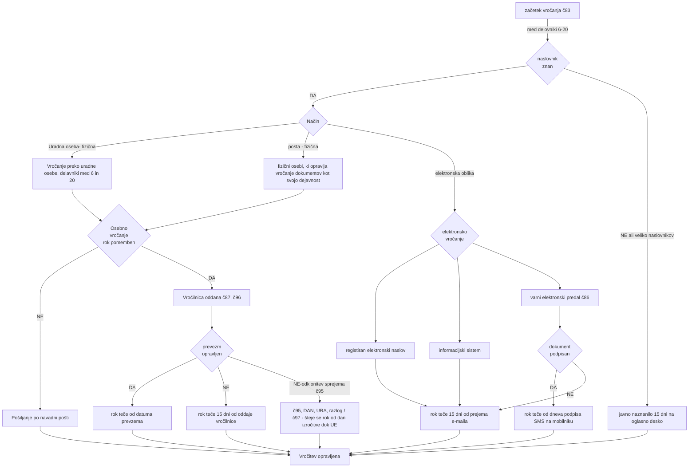

## Vročanje 
Pravne posledice odločbe ali sklepa lahko nastanejo šele po njegovi vročitvi
Kadar ima stranka zakonitega zastopnika ali pooblaščenca, se vroča njemu.

```mermaid
flowchart
A[začetek vročanja č83]
A E1@--> |med delovniki 6-20| NZ{naslovnik<BR> znan}
NZ E1@--> |DA| KV{Način}
    KV --> |Uradna oseba-  fizična| VUO[Vročanje preko uradne osebe, delavniki med 6 in 20]
        VUO -->  FO
    KV --> |posta - fizična| VDEJ[fizični osebi, ki opravlja vročanje dokumentov kot svojo dejavnost]
        VDEJ --> FO
        FO{Osebno<BR> vročanje<BR> rok pomemben}
        FO --> |NE| PNOV[Pošiljanje po navadni pošti]
            PNOV --> VRO
        FO --> |DA| VO[Vročilnica oddana č87, č96]
            VO --> PO{prevezm<BR> opravljen}
            PO --> |DA| X[rok teče od datuma prevzema]
            PO --> |NE| X1[rok teče 15 dni od oddaje vročilnice]
            PO --> |NE-odklonitev sprejema č95| X2[č95, DAN, URA, razlog / č97 - šteje se rok od dan izročitve dok UE]
    KV --> |elektronska oblika| EO{elektronsko<BR> vročanje}
        EO --> REN[registiran elektronski naslov]
            REN --> Y1
        EO --> IS[informacijski sistem]
            IS --> Y1
        EO --> VEP[varni elektronski predal č86]
            VEP --> DP{dokument<BR> podpisan}
                DP --> |DA| Y[rok teče od dneva podpisa SMS na mobilniku]
                DP --> |NE| Y1[rok teče 15 dni od prejema e-maila]
    X --> VRO
    X1 --> VRO
    X2 --> VRO
    Y --> VRO
    Y1 --> VRO
NZ --> |NE ali veliko naslovnikov| JN[javno naznanilo 15 dni na oglasno desko]
    JN --> VRO
VRO[Vročitev opravljena]
style E1 color:red
```
